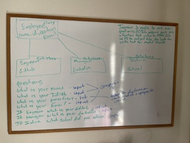

# team-hammer-profile-generator

## User Story

```md
This week our task was to build a Node.js command-line application that takes in information about employees on a software engineering team, then generates an HTML webpage that displays summaries for each person. 
```

## Table of Contents

[Acceptance-Criteria] (#Acceptance-Criteria)
[Wire-Frame] (#Wire-Frame)
[Installation-and-Usage] (#Installation-and-Usage)
[Submission-Video-Link] (#Submission-Video-Link)
[License] (#License)
[Languages-and-Tools] (#Languages-and-Tools)

## Acceptance Criteria

```md
GIVEN a command-line application that accepts user input

WHEN I am prompted for my team members and their information

THEN an HTML file is generated that displays a nicely formatted team roster based on user input

WHEN I click on an email address in the HTML

THEN my default email program opens and populates the TO field of the email with the address

WHEN I click on the GitHub username

THEN that GitHub profile opens in a new tab

WHEN I start the application

THEN I am prompted to enter the team manager’s name, employee ID, email address, and office number

WHEN I enter the team manager’s name, employee ID, email address, and office number

THEN I am presented with a menu with the option to add an engineer or an intern or to finish building my team

WHEN I select the engineer option

THEN I am prompted to enter the engineer’s name, ID, email, and GitHub username, and I am taken back to the menu

WHEN I select the intern option

THEN I am prompted to enter the intern’s name, ID, email, and school, and I am taken back to the menu

WHEN I decide to finish building my team

THEN I exit the application, and the HTML is generated
```

## Wire Frame



# Installation and Usage


## Submission Video


## License 

MIT License
  
  [](https://choosealicense.com/licenses/mit-license/.)

## Languages and Tools


